实验一
=

## 1.启动安装好的ubuntu（虚拟机未启动的时候设置该虚拟机的两块网络网卡：host-only和NAT）

### ifconfig -a查看网络状态
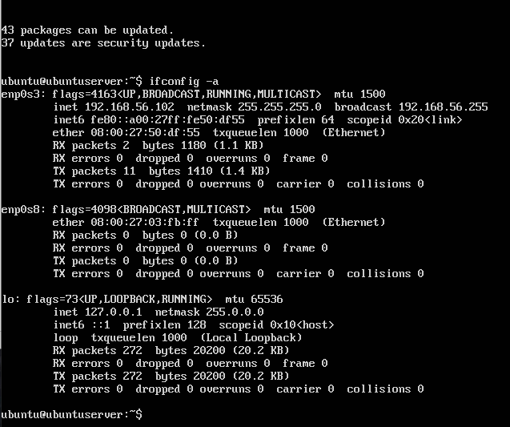
### 可以看到enp0s8所指的网卡未开启，使用下面指令将其打开
sudo ifconfig enp0s8 up

sudo dhclient enp0s8

## 2.使用putty连接虚拟机
### 最初在putty.exe中输入IP地址后，显示'connection refused'，于是去查询系统的ssh服务状态
service sshd status

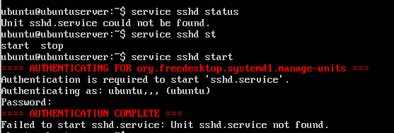
### 未发现sshd服务，尝试打开也失败，于是尝试安装sshd服务,输入下列指令一段时间后安装完毕
sudo apt-get install openssh-server

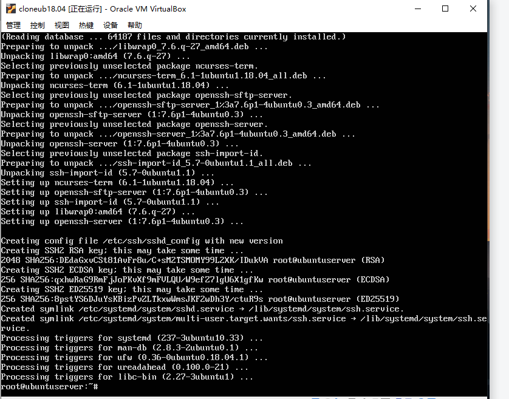

### 再次检测ssh服务是否开启
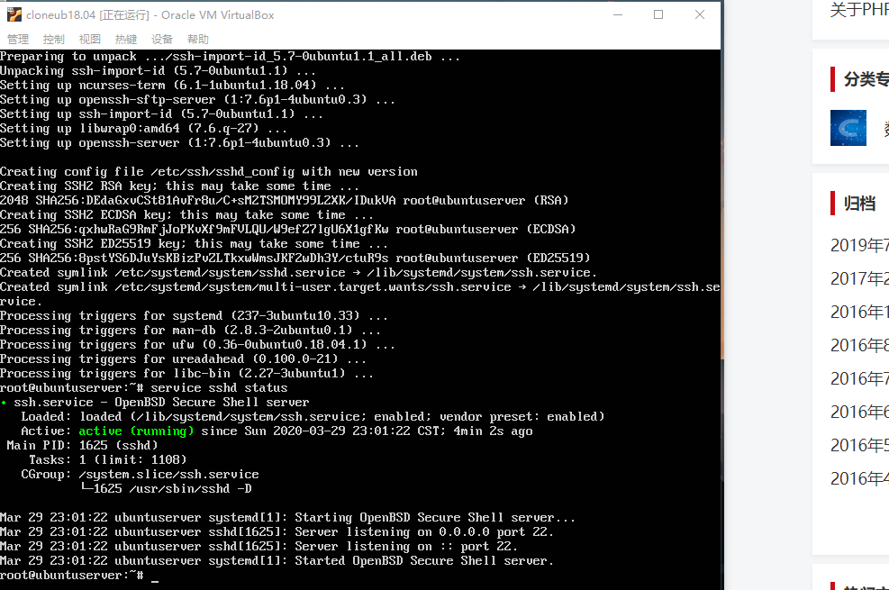

### 再次查看网卡状况
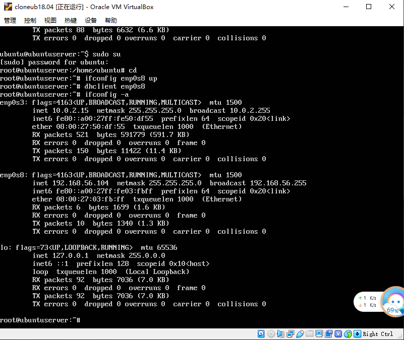

### 这里虚拟机的网络设置如下图，最初网卡1设置的是Host-Only,网卡2设置的是Net,但是putty连接失败。调换顺序后连接上了（调换顺序之后同样的指令打开enp0s8，上图和第一个图中两个网卡顺序不一样）
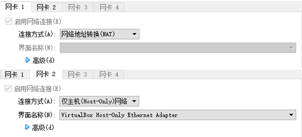

### 连接putty
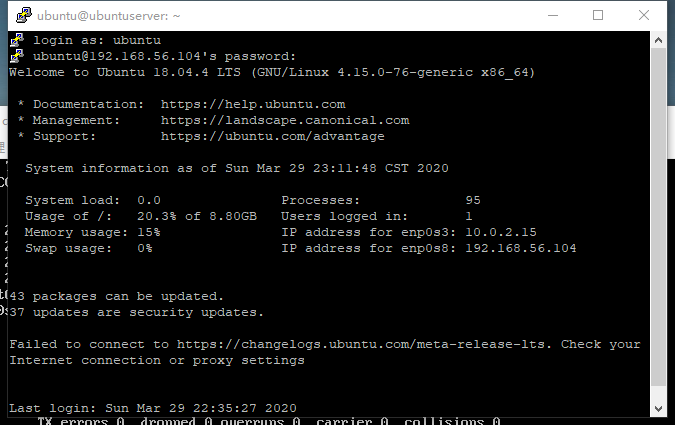

## 3.使用psftp把用于ubuntu18.04.4的镜像文件从Windows复制进虚拟机，镜像文件需要放在psftp目录下

psftp> cd /home/ubuntu

put ubuntu16.04.01

## 4.回到putty登录的虚拟机命令行
### 在当前用户目录下（/home/ubuntu）创建一个用于挂载iso镜像文件的目录
mkdir loopdir

### 挂载（mount）iso镜像到该目录
mount -o loop ubuntu-18.04.4-server-amd64.iso loopdir

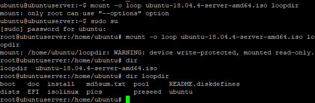

### 创建一个工作目录用于克隆光盘内容
mkdir cd

### 同步光盘内容到目标工作目录
### 一定要注意loopdir后的这个/，cd后面不能有/
rsync -av loopdir/ cd

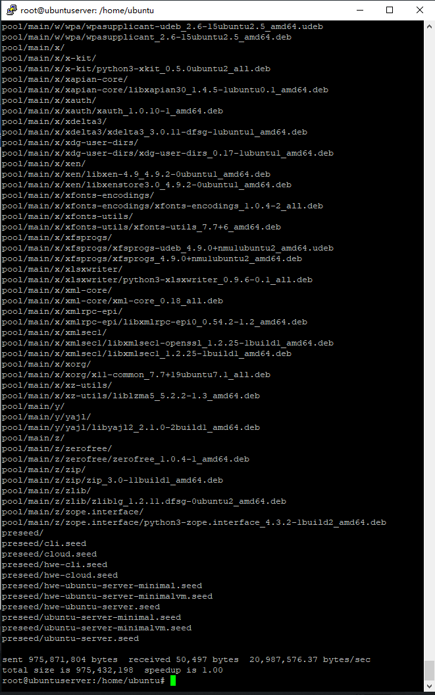
（出现很多提示信息，截取了最后的一部分）

### 卸载iso镜像
umount loopdir

### 进入目标工作目录
cd cd/

### 编辑Ubuntu安装引导界面增加一个新菜单项入口
vim isolinux/txt.cfg
### 向该文件中加入下面内容并保存
label autoinstall
  menu label ^Auto Install Ubuntu Server
  kernel /install/vmlinuz
  append  file=/cdrom/preseed/ubuntu-server-autoinstall.seed debian-installer/locale=en_US console-setup/layoutcode=us keyboard-configuration/layoutcode=us console-setup/ask_detect=false localechooser/translation/warn-light=true localechooser/translation/warn-severe=true initrd=/install/initrd.gz root=/dev/ram rw quiet

find . -type f -print0 | xargs -0 md5sum > md5sum.txt

mkisofs -r -V "Custom Ubuntu Install CD" \
            -cache-inodes \
            -J -l -b isolinux/isolinux.bin \
            -c isolinux/boot.cat -no-emul-boot \
            -boot-load-size 4 -boot-info-table \
            -o $IMAGE $BUILD

（vim使用：按i可以进入编辑模式，:q!不保存退出 :wq!强行保存退出）

### 定制preseed.cfg  此处我使用老师给出的autoinstall文件，修改了其中的默认系统用户名密码。尝试了两种方式将该文件保存到/home/ubuntu/cd/preseed/ubuntu-server-autoinstall.seed
1.用psftp传输 2.用vim编辑器创建

### 重新生成md5sum.txt
sudo su -
cd /home/cuc/cd && find . -type f -print0 | xargs -0 md5sum > md5sum.txt

### 封闭改动后的目录到.iso
IMAGE=custom.iso
BUILD=/home/cuc/cd/

mkisofs -r -V "Custom Ubuntu Install CD" \
            -cache-inodes \
            -J -l -b isolinux/isolinux.bin \
            -c isolinux/boot.cat -no-emul-boot \
            -boot-load-size 4 -boot-info-table \
            -o $IMAGE $BUILD
（参数中的空格注意不能少）

### 此时报错，于是使用下面两条指令
apt-get update

apt-get install genisoimage

### 安装过程和安装完毕后如下图
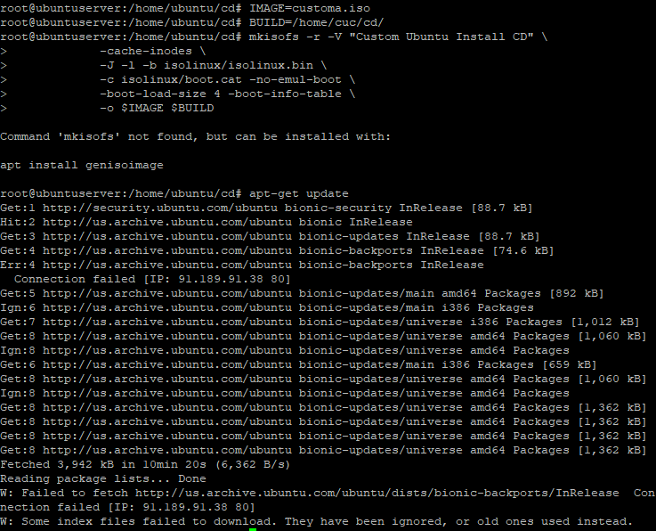

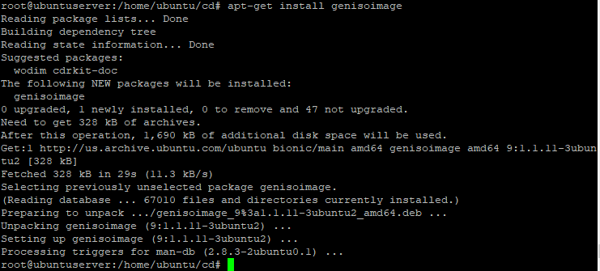

### 之后在虚拟机（/home/ubuntu/cd/）这个目录下就会出现custom.iso这个镜像，使用命令将其移动到其父文件夹内从而传输

mv custom.iso ../

## 5.打开psftp
get custom.iso

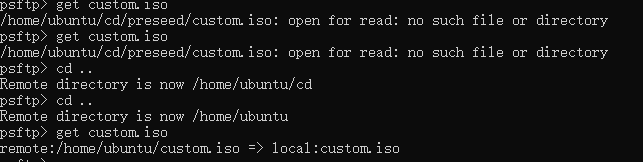

### 从虚拟机中将custom.iso这个镜像文件复制出来，这个文件就是我们需要的无人值Linux文件，打开VirtualBox 从custom.iso镜像中安装系统

## 6.用VirtualBox打开虚拟机
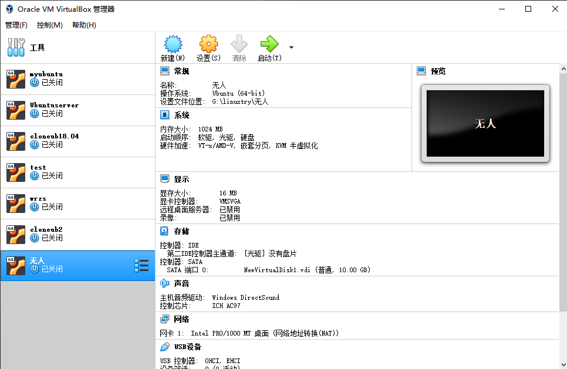

## 总结
这次实验出现了一些问题，很多是没有权限或者服务不存在，经过上面一系列的操作后生成了iso文件，知道了一些命令如 vim 的使用

但其实 实验结果不理想，运行生成的custom.iso时没有达到预期的效果，一些配置还是需要手动输入. 希望以后学会更多相关知识后能解决......
