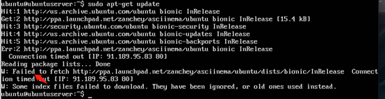
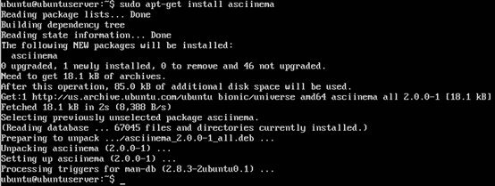
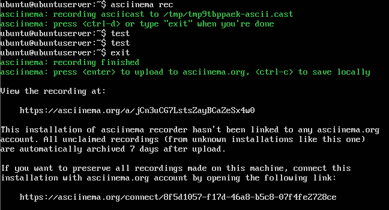

实验二
=

## 1.启动安装好的Ubuntu，输入指令安装 asciinema 如下图

    sudo apt-add-repository ppa:zanchey/asciinema

    sudo apt-get update

    sudo apt-get install asciinema

ps:输入同样的指令，第一次报错第二次可以运行

ps:
~~貌似出现错误~~

asciinema 自动关联到了我的账户

## 2.打开putty连接虚拟机，在putty中操作vimtutor,便于复制

    vimtutor

### 附上使用 asciinema 录屏的链接(分成了两个，第一个是vimtutor的前两节，第二个是后面的章节)

[part1](https://asciinema.org/a/qF2vYqZkGtCo65Xf5cvcYeXvE "第一段录屏")
/
[part2](https://asciinema.org/a/fuvF1E5gDiEBUVxDAVAFlf1Ue "第二段录屏")

